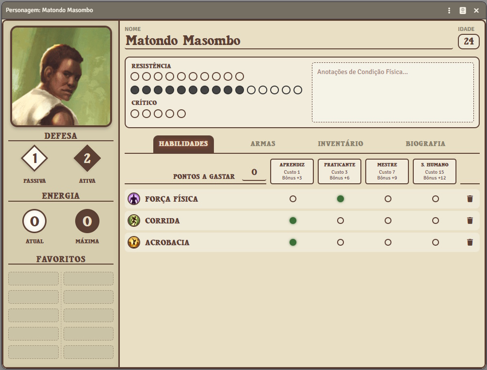
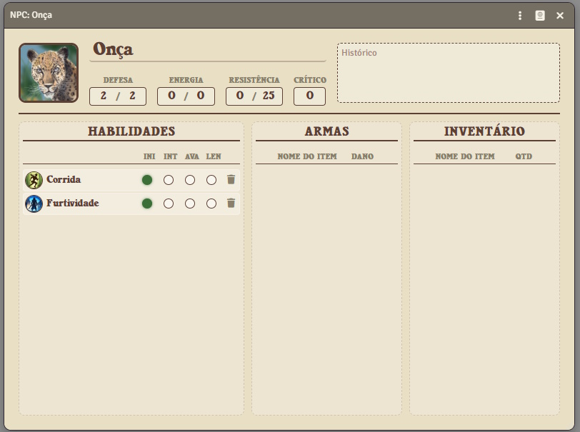
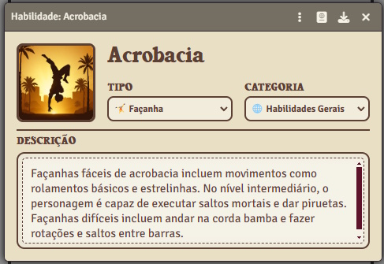
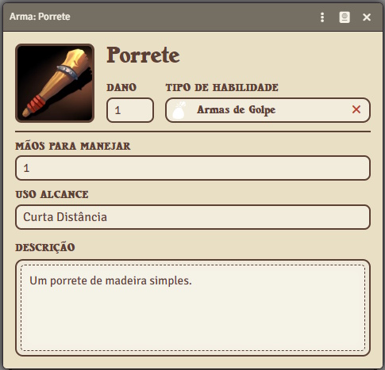
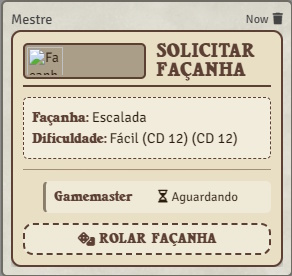
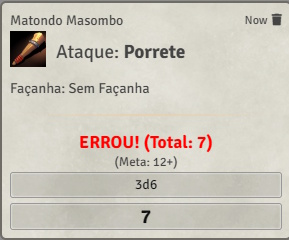
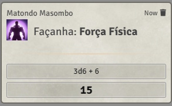

# Guia de Uso - Módulo A Bandeira do Elefante e da Arara (Foundry VTT)

Bem-vindo ao guia de utilização do módulo oficial de **A Bandeira do Elefante e da Arara** para Foundry VTT. Este documento explica como operar o sistema digital, criar personagens, gerenciar itens e realizar rolagens.

## 1. Primeiros Passos: Criando Atores

O sistema possui dois tipos principais de atores: **Personagem** e **NPC**.

1. Vá para a aba **Atores** (ícone de pessoas).
2. Clique em **Criar Ator**.
3. Escolha o nome e selecione o tipo:
   - **Personagem**: Para jogadores. Possui ficha completa com inventário, habilidades e biografia.
   - **NPC**: Ficha simplificada para o Mestre, ideal para antagonistas e figurantes.



---

## 2. A Ficha de Personagem

A ficha é o coração do jogo. Ela é dividida em seções para facilitar o acesso:

### Cabeçalho e Atributos
No topo da ficha, você encontra os atributos vitais:
- **Defesa**: Passiva e Ativa.
- **Energia**: Valor atual e máximo (usado para ativar poderes e façanhas).
- **Condição**: Mostra a **Resistência** (pontos de vida) e o nível de **Crítico**.

### Abas Principais

- **Habilidades**: Lista todas as perícias (Façanhas e Sobrenaturais). Mostra o nível (Aprendiz, Praticante, Mestre) e o bônus total.
- **Inventário**: Gerencia equipamentos gerais e dinheiro (Bronze, Prata, Ouro, Réis).
- **Armas**: Lista as armas equipadas e permite realizar ataques rapidamente.
- **Biografia**: Espaço para história e características do personagem.

> **Dica:** Você pode arrastar tens, armas e habilidades diretamente dos compêndios (packs) para a ficha do personagem.


*A ficha de NPC (acima) simplifica essas informações para consulta rápida do Mestre.*

---

## 3. Gerenciando Itens e Habilidades

O sistema trata Habilidades, Armas e Itens como objetos que podem ser criados, editados e excluídos.

### Criando um Item
1. Vá para a aba **Itens** (ícone da mala).
2. Clique em **Criar Item** e escolha o tipo:
   - **Habilidade**: Façanhas, Graças Divinas, Poderes.
   - **Arma**: Armamentos de combate.
   - **Item**: Equipamentos gerais, poções, ferramentas.

### Editando um Item
Ao clicar no ícone do item (ou abrir sua ficha), você pode configurar:
- **Façanhas**: Definir a Categoria (Geral, Combate, etc.) e o Posto (Nível).
- **Armas**: Definir Dano, Alcance, Mãos necessárias e qual Habilidade é usada para o teste de ataque.

| Ficha de Façanha | Ficha de Item |
| :---: | :---: |
|  |  |

---

## 4. O Sistema de Façanhas (Testes)

Uma das ferramentas mais poderosas do módulo é o **Solicitador de Façanhas**, que permite ao Mestre pedir testes para os jogadores de forma automatizada.

### Como Solicitar (Para o Mestre)
1. Na barra de ferramentas à esquerda, selecione a camada de **Anotações** (ícone de prancheta/mapa).
2. Clique no ícone do sistema **ABEA** (Escudo).
3. Selecione a ferramenta **Solicitar Façanha** (Dado).
4. Uma janela se abrirá. Escolha a **Façanha** desejada (ex: Natação), a **Dificuldade** e quais jogadores devem rolar.
5. Clique em **Solicitar**.


### Respondendo à Solicitação (Para os Jogadores)
Um "Card" aparecerá no chat. Cada jogador selecionado verá um botão para rolar o teste.
- Ao clicar em **Rolar Façanha**, o sistema calcula automaticamente os bônus da ficha do personagem e exibe o resultado.
- O card é atualizado em tempo real, mostrando quem passou e quem falhou.



---

## 5. Combate e Rolagens

Todas as rolagens são feitas diretamente pela ficha e exibidas no chat com visual customizado.

### Rolagens de Ataque
Na aba **Armas** da ficha, clique no ícone do dado (ou na imagem da arma) para atacar. O sistema rolará o teste de habilidade associado e exibirá o dano (se houver).



### Rolagens de Habilidade (Individuais)
Você não precisa esperar o Mestre solicitar. Na aba **Habilidades**, basta clicar no nome da habilidade para fazer um teste avulso.



---

## Dicas Adicionais

- **Favoritos**: Na ficha do personagem, você pode "favoritar" rolagens que usa com frequência para que fiquem no topo da lista.
- **Compêndios**: O módulo já vem com compêndios de Armas e Façanhas pré-configurados. Use-os para economizar tempo na criação de personagens!

---

## 6. Automação de Imagens (Para GMs e Devs)

Para manter o sistema leve, incluímos um script Python em `tools/scripts/optimize_images.py` que converte imagens para o formato `.webp` e remove todos os metadados.

### Como usar:
1. Certifique-se de ter o Python e a biblioteca Pillow instalados:
   ```bash
   pip install Pillow
   ```
2. Execute o script passando a pasta de origem e a pasta de destino dentro do módulo:
   ```bash
   python tools/scripts/optimize_images.py --source "C:/MinhasImagens" --dest "C:/Users/.../Data/systems/abea/assets/item/weapons"
   ```
   *O script converterá todas as imagens para .webp, garantindo melhor performance no Foundry VTT.*

