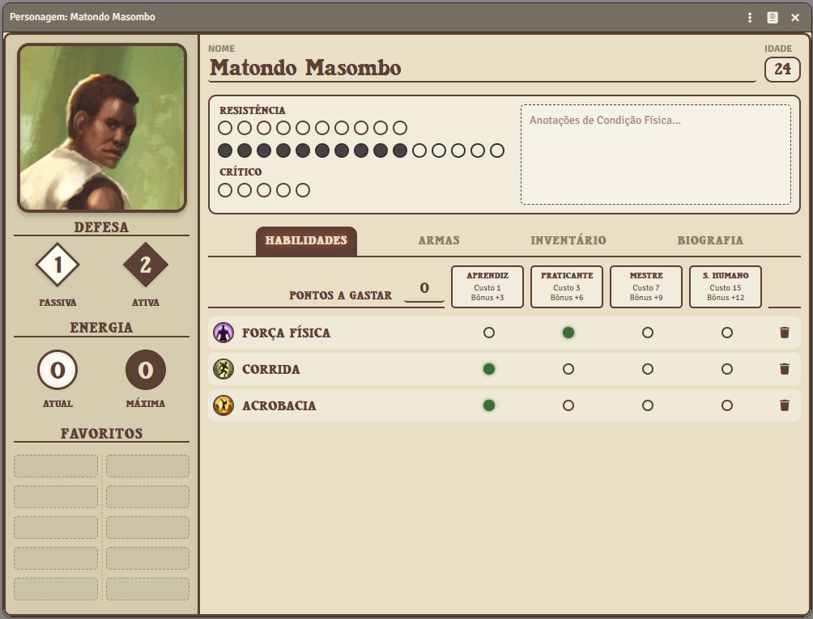
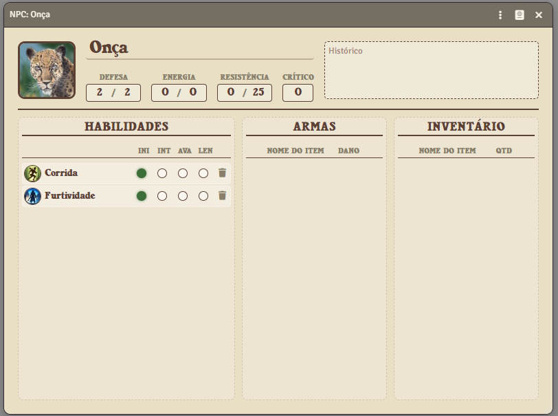
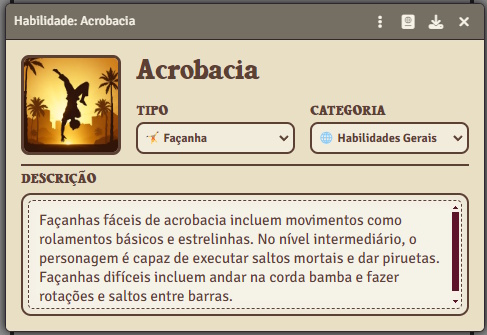
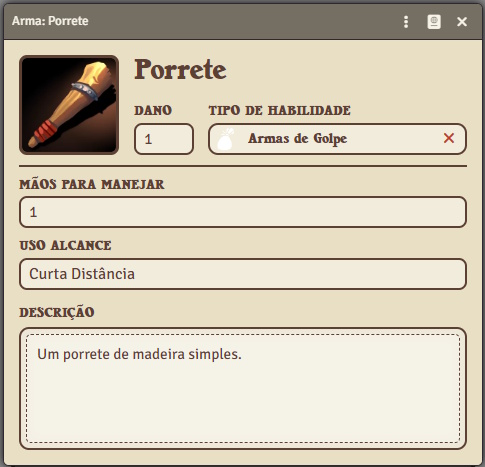
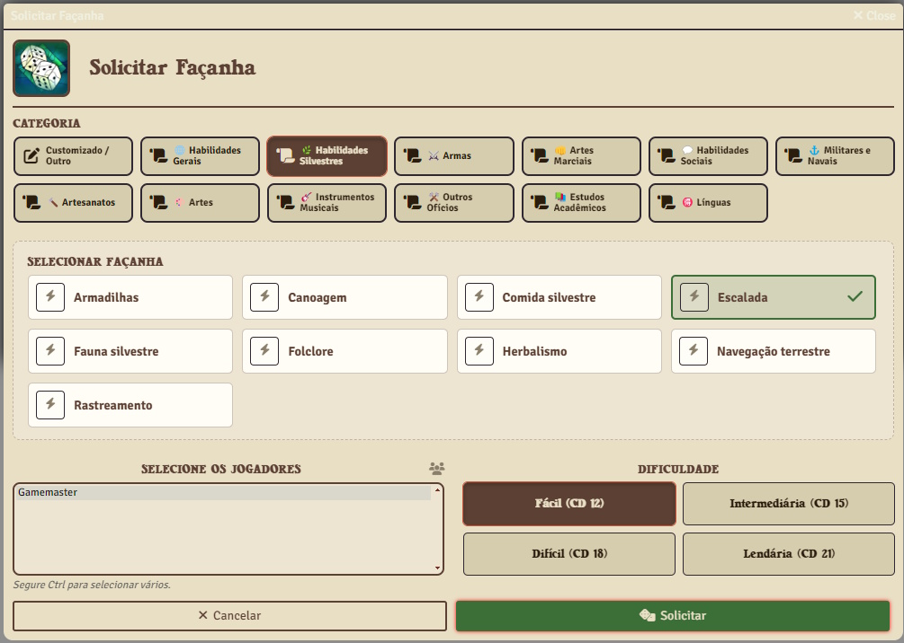
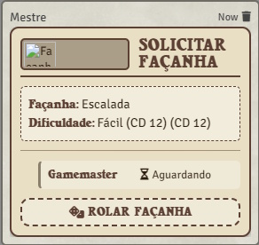
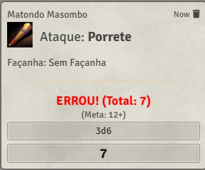
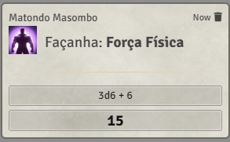

# A Bandeira do Elefante e da Arara - Sistema para FoundryVTT

Este sistema implementa as regras oficiais do RPG **A Bandeira do Elefante e da Arara** (ABEA) para o Foundry Virtual Tabletop, permitindo que você jogue suas aventuras no Brasil Colonial digitalmente.

## Sobre A Bandeira do Elefante e da Arara

**A Bandeira do Elefante e da Arara** é uma série de fantasia premiada criada por [Christopher Kastensmidt](https://abandeira.org/), ambientada no Brasil do século XVI. As histórias narram as aventuras do explorador holandês Gerard van Oost e do guerreiro iorubá Oludara enquanto desbravam um país repleto de criaturas do folclore brasileiro, como o Saci-Pererê, o Boitatá e o Curupira.

A série é reconhecida internacionalmente, tendo recebido diversas indicações e prêmios, celebrada por sua pesquisa histórica detalhada e integração respeitosa e criativa da mitologia nacional.

Para saber mais sobre o universo, os livros e o autor, visite o **site oficial**:
[https://abandeira.org/](https://abandeira.org/)

## Requisitos

- **Foundry VTT versão 14** ou superior (testado na 14.360).
- Para jogar na versão 13, use as versões 1.0.x do sistema.

## Recursos

O sistema segue as regras do *Livro de Interpretação de Papéis* (Devir, 2017). As referências de página abaixo são desse livro.

### Fichas

- **Ficha de Personagem**, com abas de Habilidades, Armas, Equipamento e Biografia, e um painel lateral com retrato, defesa, energia e **10 favoritos** de acesso rápido. Os favoritos se preenchem arrastando habilidades ou itens e se reordenam também arrastando.
- **Ficha de NPC**: página única e compacta, para o Mestre consultar e preencher rápido. Defesa, energia e resistência são digitadas à mão.
- **Fichas de item** para Item, Arma, Habilidade e Característica.
- Tudo funciona **arrastando dos compêndios** para a ficha.

### Habilidades e façanhas (p. 15–18)

- Cada habilidade vai do nível 1 ao 4 (Aprendiz, Praticante, Mestre, Lendário), com bônus de +3 a +12.
- **Rolagem de façanha**: 3d6 + bônus. Três 6 é sucesso épico, três 1 é fracasso épico. O resultado vai para o chat.
- **Pontos de aprendizagem** (p. 16, 89):
  - Subir de nível custa 1 / 2 / 4 / 8 pontos, e o sistema bloqueia a subida se faltarem pontos.
  - Descer de nível ou excluir uma habilidade devolve os pontos.
  - O Mestre tem um botão para dar pontos (+2 por sessão, por padrão), e só ele edita o total direto.
- **Penalidade por ferimento** (p. 37): com 3 ou menos pontos de resistência sobrando, o personagem perde um nível em todas as façanhas. A ficha mostra a etiqueta **FERIDO**.

### Condição física e defesa (p. 36–38)

- **Resistência máxima calculada**:
  - começa em 10;
  - ganha +1 por Acrobacia, Corrida, Força Física, Natação, Escalada, Capoeira ou Luta Livre no nível 3 (o Boxe dá +1 no nível 2 e mais +1 no 3);
  - aceita bônus temporários (poções, por exemplo);
  - vai até no máximo 15.
- **Dano automático**:
  - o dano além do máximo vai para o **dano crítico**;
  - o personagem fica **Inconsciente** ao zerar a resistência e **Morto** com 5 pontos de crítico, com os status aparecendo no token;
  - NPCs morrem ao zerar a resistência.
- **Defesa calculada pelo equipamento**:
  - **passiva** = capacete +1, colete ou peitoral +1;
  - **ativa** = passiva + melhor nível em arma corpo a corpo ou arte marcial + escudo;
  - máximo 5. Passar o mouse sobre a defesa mostra de onde vem cada ponto.

### Combate (p. 39–45)

- **Iniciativa 3d6**; em empate, o personagem de jogador age antes.
- Clicar numa arma abre a escolha da **ação de combate**:

  | Ação | Teste | Efeito |
  |---|---|---|
  | Ataque corpo a corpo | fácil − defesa ativa do alvo | dano da arma |
  | Ataque forte | difícil − defesa ativa | dano +2 |
  | Ataque preciso | difícil − defesa ativa ou passiva | dano +2 |
  | Ataque à distância | pela faixa de alcance − defesa passiva | dano da arma |
  | Arma de distância no corpo a corpo | fácil − defesa ativa, com −3 | dano da arma |
  | Desarmar | lendária | derruba a arma do alvo |
  | Agarrar (Luta Livre) | depende do nível do alvo em armas | imobiliza |

- **Ações sem arma**, durante o combate:
  - **Defender-se**: +2 na defesa ativa até o fim da rodada;
  - **Esquivar-se**: com Capoeira ou Acrobacia, +2 na defesa passiva até o fim da rodada;
  - **Auxiliar ataque**: +2 no próximo ataque de um aliado contra o alvo.
- **Alcance das armas** (p. 87): cada arma tem faixas normal, estendida, distante e máxima, em varas. A distância até o alvo é medida no mapa e define a dificuldade do tiro.
- **Condição da arma** (p. 87): de danificada (−3) a lendária (+3), somada nos testes de ataque.
- **Dano aplicado automaticamente** no alvo. Se o jogador não controla o alvo, o pedido vai para o Mestre.

### Poderes sobrenaturais (p. 46–58)

- Três linhas: **Graças Divinas** (Fé), **Poderes de Fôlego** (pajés) e **Poderes de Ifá** (babalaôs).
- **Energia diária** pelo nível da habilidade base: 5 / 10 / 20 / 40. Um botão **Descansar** recupera a energia.
- Ao usar um poder, escolhe-se o **nível**: fácil gasta 1 de energia, intermediária 2 e difícil 4. Nenhum poder passa o nível da habilidade base.

### Façanhas em grupo

Ferramenta do Mestre, no grupo **ABEA** dos controles de cena, para pedir um teste a vários jogadores ao mesmo tempo:

- o Mestre escolhe a façanha (da lista do livro ou personalizada), a dificuldade e os jogadores;
- cada jogador rola pelo card no chat;
- o card mostra em tempo real quem passou e quem falhou.

### Mensagens de chat

Todas as mensagens do sistema usam cards no mesmo estilo:

- rolagem de habilidade;
- ataque, com ação, dificuldade, defesa usada, distância e modificadores;
- uso de poder;
- uso de item (cura, por exemplo);
- Façanha.

O total dos dados fica em destaque: verde no sucesso épico, vermelho no fracasso épico.

### Itens, preços e macros

- **Itens de cura** que reduzem o dano e podem ser consumíveis.
- **Preço de referência** em réis (p. 92–96), exibido na ficha do item e no inventário.
- **Dinheiro** em ouro, prata e bronze, convertido para réis.
- **Macros**: arraste uma habilidade ou item da ficha para a barra de atalhos.

### Compêndios

| Compêndio | Conteúdo |
|---|---|
| **Habilidades** | 125 habilidades do livro, com arte própria: gerais, silvestres, armas e artes marciais, sociais, militares e navais, artesanatos, artes, instrumentos musicais, outros ofícios, estudos acadêmicos, línguas e poderes sobrenaturais |
| **Armas** | 27 armas, com dano, alcance e preço |
| **Itens** | 53 itens: armaduras, ferramentas, poções, amuletos e itens lendários |
| **Características** | 93 traços de personalidade do livro (p. 32–34), com os defeitos marcados |

### Idiomas

Português (Brasil) e inglês. O idioma do sistema pode ser definido nas configurações do mundo.

## Visual do Sistema

### 1. Ficha de Personagem

### 2. Ficha de NPC

### 3. Itens e Habilidades

| Habilidade | Item/Equipamento |
| :---: | :---: |
|  |  |

### 4. Façanhas em Grupo

| Ferramenta do Mestre | Card de Façanha no Chat |
| :---: | :---: |
|  |  |

### 5. Rolagens e Combate

| Rolagem de Ataque | Rolagem de Façanha |
| :---: | :---: |
|  |  |

## Instalação

Copie o link do manifesto abaixo e cole na aba de "Sistemas de Jogo" no Foundry VTT para instalar:
`https://github.com/rafarvns/abea-foundryvtt-system/releases/latest/download/system.json`

Para um passo a passo de uso (criar personagens, itens e rolagens), veja o [Guia de Uso](GUIA_DE_USO.md).

## Desenvolvimento

Link para o repositório:
[https://github.com/rafarvns/abea-foundryvtt-system](https://github.com/rafarvns/abea-foundryvtt-system)

- O código fica em `scripts/`: documentos, modelos de dados, fichas e regras em `scripts/helpers/rules.mjs`, com as tabelas do livro em `scripts/config.mjs`.
- A documentação da API do Foundry v14 está em `docs/v14/` (ver [docs/README.md](docs/README.md)). A da v13 fica em `docs/v13/`, só para consulta.

## Contribuição

Este projeto é de código aberto e construído pela comunidade para a comunidade. Acreditamos que todos podem contribuir para tornar a experiência de jogo ainda melhor!

Se você encontrou um bug, tem uma ideia para uma nova funcionalidade ou quer melhorar a documentação, adoraríamos receber sua ajuda. Não é necessário ser um especialista em programação para participar.

### Como Participar?

- **Reporte Bugs e Sugira Melhorias:** Utilize a aba [Issues](https://github.com/rafarvns/abea-foundryvtt-system/issues) para nos informar sobre problemas ou compartilhar suas ideias.
- **Contribua com Código:** Se você desenvolve, confira as issues abertas ou proponha suas próprias correções.
- **Tradução e Conteúdo:** Ajude a revisar textos e melhorar a qualidade do material.

Todo tipo de colaboração é bem-vinda para manter a bandeira tremulando alto!

## Git Flow

- Crie um branch a partir da `dev`
- Implemente nessa branch sua alteração
- Faça um pull request dessa branch para `dev`, descrevendo a feature ou o bugfix
- Aguarde a avaliação de algum admin do repositorio aprovar, se for aprovado, na proxima release de `dev` para `main`, o recurso estará disponivel para todos automaticamente.
